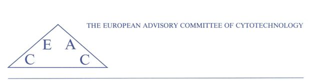

# EACC Website

- https://isi-mube.github.io/EACC-Website/
  
A prototype website for the **European Advisory Committee of Cytotechnology (EACC)**, to be integrated into the [**European Federation of Cytology Societies (EFCS)**](https://www.efcs.eu/) environment.

## Purpose of the Website

In Europe, there are about 4000 Cytotechnologists. Without their constant and dedicated work, the fight against cervical cancer would be impossible. 

The goal of this website is to increase communication and collaboration among cytotechnological delegates from all countries in Europe, under the auspices of the **European Federation of Cytology Societies (EFCS)**.

The **European Advisory Committee of Cytotechnology (EACC)** aims to support and regulate the cytotechnologist profession across Europe. The committee is composed of members, a chairperson, and a secretary.

## Current Content

- **Home**
- **EACC Committee Members**

## In Development
- Current Activities
- Webinars
- EACC Regulations
- Resources
